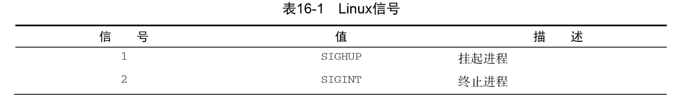
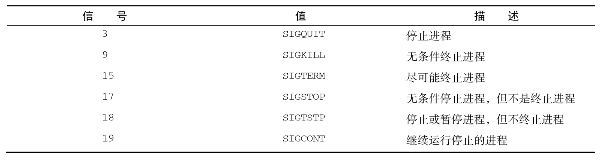

# 控制脚本

## 处理信号

Linux 利用信号与运行在系统中的进程进行通信。可以通过对脚本进行编程，使其在收到特定信号时执行 某些命令，从而控制 shell 脚本的操作。

### 重温 Linux 信号

Linux 系统和应用程序可以生成超过 30 个信号。




默认情况下，bash shell 会忽略收到的任何 SIGQUIT (3)和 SIGTERM (5)信号（正因为这样， 交互式 shell 才不会被意外终止）。但是 bash shell 会处理收到的 SIGHUP (1)和 SIGINT (2)信号。

如果 bash shell 收到了 SIGHUP 信号，比如当你要离开一个交互式 shell，它就会退出。但在退 出之前，它会将 SIGHUP 信号传给所有由该 shell 所启动的进程（包括正在运行的 shell 脚本）。

通过 SIGINT 信号，可以中断 shell。Linux 内核会停止为 shell 分配 CPU 处理时间。这种情况发 生时，shell 会将 SIGINT 信号传给所有由它所启动的进程，以此告知出现的状况。

shell 会将这些信号传给 shell 脚本程序来处理。而 shell 脚本的默认行为 是忽略这些信号。它们可能会不利于脚本的运行。要避免这种情况，你可以脚本中加入识别信 号的代码，并执行命令来处理信号。

### 生成信号

bash shell 允许用键盘上的组合键生成两种基本的 Linux 信号。这个特性在需要停止或暂停失 控程序时非常方便。

**1、中断进程**

Ctrl+C 组合键会生成 SIGINT 信号，并将其发送给当前在 shell 中运行的所有进程。

**2、暂停进程**

Ctrl+Z 组合键会生成一个 SIGTSTP 信号，停止 shell 中运行的任何进程。停止（stopping）进程跟终止（terminating）进程不同：停止进程会让程序继续保留在内存中，并能从上次停止的位置 继续运行。


方括号中的数字是 shell 分配的作业号（job number）。shell 将 shell 中运行的每个进程称为作业， 并为每个作业分配唯一的作业号。它会给第一个作业分配作业号 1，第二个作业号 2，以此类推。

如果你的 shell 会话中有一个已停止的作业，在退出 shell 时，bash 会提醒你。

可以用 ps 命令来查看已停止的作业。

```bash
ps -l
```
